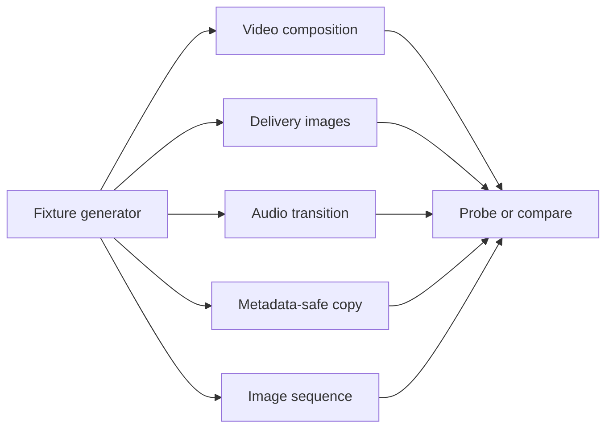

# Runnable demo lab

I wanted one small lab where every command uses files the repository can make
locally. The sources are synthetic, so the lab does not need downloads or
licensed media.

## Prepare the lab

Run these commands from a cloned repository:

```console
python scripts/make_demo_media.py demo-media
mkdir demo-output
flowmpeg doctor
```

The generator creates short video, audio, image, subtitle, and sequence inputs.
Each job below writes to `demo-output`, leaving the fixtures unchanged.



## Video composition

Join two matching clips, place them in a row, and add a transparent mark:

```console
flowmpeg join demo-media/sample.mp4 demo-media/second.mp4 --no-progress -o demo-output/joined.mp4
flowmpeg grid demo-media/sample.mp4 demo-media/second.mp4 --columns 2 --cell-width 320 --cell-height 180 --no-progress -o demo-output/grid.mp4
flowmpeg mark demo-media/sample.mp4 demo-media/logo.png --position top-right --width 64 --no-progress -o demo-output/branded.mp4
```

`joined.mp4` is about four seconds long. `grid.mp4` is 640 by 180 and keeps the
longest input timeline. `branded.mp4` keeps the source audio.

## Delivery images and social video

Create a square copy, a short GIF, and a four-frame overview:

```console
flowmpeg social demo-media/sample.mp4 --target square --fill blur --no-progress -o demo-output/square.mp4
flowmpeg gif demo-media/sample.mp4 --full-length --width 240 --fps 6 --no-progress -o demo-output/preview.gif
flowmpeg contact-sheet demo-media/sample.mp4 --columns 2 --rows 2 --interval 0.5 --cell-width 160 --cell-height 90 --no-progress -o demo-output/sheet.jpg
```

The square video is 1080 by 1080. The GIF has no audio. The contact sheet puts
four sampled moments into one image, which is useful for quick review pages.

## Audio transition

Blend the generated voice and music tones over half a second:

```console
flowmpeg crossfade demo-media/voice.wav demo-media/music.wav --duration 0.5 --codec wav --no-progress -o demo-output/blend.wav
```

Both inputs are two seconds long, so `blend.wav` is about 3.5 seconds long.

## Metadata-safe copy

Remove container metadata and chapters from the branded result:

```console
flowmpeg clean-metadata demo-output/branded.mp4 --no-progress -o demo-output/clean.mp4
flowmpeg compare demo-output/branded.mp4 demo-output/clean.mp4
```

The copy keeps the first video and audio streams. The comparison table makes
codec, dimensions, duration, and size changes visible.

## Numbered image sequence

Turn the four generated PNG files into a two-second video:

```console
flowmpeg timelapse demo-media/frame-%03d.png --fps 2 --start-number 1 --no-progress -o demo-output/sequence.mp4
flowmpeg probe demo-output/sequence.mp4 --json
```

## Expected results

| Output | Expected shape | Main check |
|---|---|---|
| `joined.mp4` | About 4 seconds | Video and audio remain present |
| `grid.mp4` | 640 by 180 | Both sources appear side by side |
| `branded.mp4` | 320 by 180 | Mark appears at the top right |
| `square.mp4` | 1080 by 1080 | Main frame is centered over a blurred fill |
| `preview.gif` | 240 pixels wide | Animation contains the full source timeline |
| `sheet.jpg` | Two columns by two rows | Four distinct moments appear |
| `blend.wav` | About 3.5 seconds | The tones overlap for half a second |
| `clean.mp4` | Same stream kinds as branded input | Container metadata is absent |
| `sequence.mp4` | About 2 seconds | Four frames play at 2 frames per second |

Use `--dry-run --explain` before an editing command to inspect its FFmpeg plan
without writing the output.
