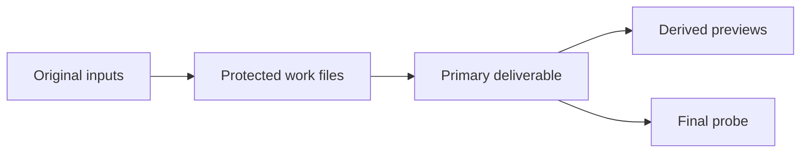

# Four media playbooks

These playbooks connect several one-line jobs into a deliverable. Every stage
uses a new path so the original and each useful intermediate remain protected.
Create the `work` and `deliver` directories before running the commands.

```text
source files -> work intermediates -> deliver files -> final probe
```

Flowmpeg does not create parent directories. It also does not remove
intermediate files after a run.

## Lesson with selectable captions

### Inputs and results

| File | Role |
|---|---|
| `lecture.mp4` | Full camera recording |
| `logo.png` | Course mark with transparency |
| `captions.srt` | Captions timed from the start of the trimmed lesson |
| `deliver/lesson-captioned.mp4` | H.264 lesson with AAC audio and selectable text |

Check the three feature groups used by the sequence:

```console
flowmpeg doctor --require web-video
flowmpeg doctor --require composition
flowmpeg doctor --require subtitles
```

Inspect the source streams, then build each stage:

```console
flowmpeg probe lecture.mp4
flowmpeg cut lecture.mp4 --start 120 --duration 600 --expected-duration 600 -o work/lesson.mp4
flowmpeg mark work/lesson.mp4 logo.png --position top-right --width 160 -o work/lesson-branded.mp4
flowmpeg captions work/lesson-branded.mp4 captions.srt --language eng -o deliver/lesson-captioned.mp4
flowmpeg probe deliver/lesson-captioned.mp4 --json
```

The last probe should report one video stream, one audio stream, and one
subtitle stream. A player may require captions to be enabled because the text
track is selectable. If the camera recording is silent, add `--no-audio` to
the cut, mark, and captions commands.

The same edit stages in Python are:

```python
from flowmpeg import shortcuts as ff

ff.trim("lecture.mp4", "work/lesson.mp4", start=120, duration=600).run()
ff.watermark("work/lesson.mp4", "logo.png", "work/lesson-branded.mp4", width=160).run()
ff.add_subtitles("work/lesson-branded.mp4", "captions.srt", "deliver/lesson-captioned.mp4", language="eng").run()
```

## Podcast audio and audiogram

### Inputs and results

| File | Role |
|---|---|
| `raw-voice.wav` | Unfinished spoken-word recording |
| `cover.jpg` | Static square artwork |
| `deliver/episode.m4a` | Leveled AAC audio with tags |
| `deliver/episode-audiogram.mp4` | Cover video with an animated waveform |

Check the required groups:

```console
flowmpeg doctor --require voice-cleanup
flowmpeg doctor --require audio-files
flowmpeg doctor --require audiogram
```

Build the audio master, copy it with tags, then create the video:

```console
flowmpeg voice raw-voice.wav --codec aac --bitrate 192k -o work/episode.m4a
flowmpeg tag-audio work/episode.m4a --title "Episode 12" --artist "Example Host" --album "Example Show" --date 2026 -o deliver/episode.m4a
flowmpeg audiogram deliver/episode.m4a cover.jpg --width 1080 --height 1080 --wave-width 900 --wave-height 180 -o deliver/episode-audiogram.mp4
flowmpeg probe deliver/episode.m4a --json
flowmpeg probe deliver/episode-audiogram.mp4 --json
```

The tag stage copies compressed audio, so it does not run another AAC encode.
The audiogram is a separate H.264 MP4 and ends with the selected audio track.

Python uses the same file boundaries:

```python
from flowmpeg import shortcuts as ff

ff.podcast_voice("raw-voice.wav", "work/episode.m4a", codec="aac", bitrate="192k").run()
ff.tag_audio("work/episode.m4a", "deliver/episode.m4a", title="Episode 12", artist="Example Host", album="Example Show", date="2026").run()
ff.podcast_audiogram("deliver/episode.m4a", "cover.jpg", "deliver/episode-audiogram.mp4", width=1080, height=1080, wave_width=900, wave_height=180).run()
```

## Tape review package

This playbook creates access files for review. Keep the captured source as the
preservation file; an H.264 output is not presented here as an archive master.

### Inputs and results

| File | Role |
|---|---|
| `tape-capture.mpg` | Captured source |
| `deliver/tape-progressive.mp4` | Deinterlaced review video |
| `deliver/tape-sheet.jpg` | Fifteen-frame visual index |
| `deliver/tape-cover.jpg` | One frame for a catalog record |

Check video and review-image support:

```console
flowmpeg doctor --require creator-video
flowmpeg doctor --require analysis-images
```

Inspect before filtering and after delivery:

```console
flowmpeg probe tape-capture.mpg --json
flowmpeg deinterlace tape-capture.mpg --mode bwdif -o deliver/tape-progressive.mp4
flowmpeg sheet deliver/tape-progressive.mp4 --columns 5 --rows 3 --interval 120 -o deliver/tape-sheet.jpg
flowmpeg thumb deliver/tape-progressive.mp4 --at 30 --width 1280 -o deliver/tape-cover.jpg
flowmpeg probe deliver/tape-progressive.mp4 --json
```

The sheet samples one frame every two minutes. Change `--interval` after
checking the recording duration. Deinterlacing should only be applied when the
source is actually interlaced.

Python calls for the three outputs are:

```python
from flowmpeg import shortcuts as ff

ff.deinterlace("tape-capture.mpg", "deliver/tape-progressive.mp4", mode="bwdif").run()
ff.contact_sheet("deliver/tape-progressive.mp4", "deliver/tape-sheet.jpg", columns=5, rows=3, interval=120).run()
ff.thumbnail("deliver/tape-progressive.mp4", "deliver/tape-cover.jpg", at=30, width=1280).run()
```

## Product demo delivery set

### Inputs and results

| File | Role |
|---|---|
| `screen.mp4` | Main screen recording with narration |
| `camera.mp4` | Presenter camera |
| `logo.png` | Product mark |
| `deliver/demo.mp4` | Edited landscape demo |
| `deliver/demo.gif` | Short silent preview |
| `deliver/demo-vertical.mp4` | Vertical social copy |
| `deliver/demo-square.mp4` | Square social copy |

Check composition, GIF, and web-video groups:

```console
flowmpeg doctor --require composition
flowmpeg doctor --require animated-gif
flowmpeg doctor --require web-video
```

Compose the camera, select the useful section, add the mark, then derive the
delivery variants:

```console
flowmpeg pip screen.mp4 camera.mp4 --inset-width 360 --position bottom-right -o work/demo-camera.mp4
flowmpeg cut work/demo-camera.mp4 --start 8 --duration 75 --expected-duration 75 -o work/demo-cut.mp4
flowmpeg mark work/demo-cut.mp4 logo.png --position top-left --width 140 -o deliver/demo.mp4
flowmpeg gif deliver/demo.mp4 --start 5 --duration 4 --width 480 --fps 10 -o deliver/demo.gif
flowmpeg social deliver/demo.mp4 --target vertical --fill blur -o deliver/demo-vertical.mp4
flowmpeg social deliver/demo.mp4 --target square --fill fit -o deliver/demo-square.mp4
```

The picture-in-picture job keeps audio from `screen.mp4`; camera audio is not
mixed. The GIF has no audio. Both social files encode from the finished demo,
so inspect `deliver/demo.mp4` before starting those longer jobs.

Python can build the same set:

```python
from flowmpeg import shortcuts as ff

ff.picture_in_picture("screen.mp4", "camera.mp4", "work/demo-camera.mp4", inset_width=360).run()
ff.trim("work/demo-camera.mp4", "work/demo-cut.mp4", start=8, duration=75).run()
ff.watermark("work/demo-cut.mp4", "logo.png", "deliver/demo.mp4", position="top-left", width=140).run()
ff.make_gif("deliver/demo.mp4", "deliver/demo.gif", start=5, duration=4, width=480, fps=10).run()
ff.social_video("deliver/demo.mp4", "deliver/demo-vertical.mp4", target="vertical", fill="blur").run()
ff.social_video("deliver/demo.mp4", "deliver/demo-square.mp4", target="square", fill="fit").run()
```

## File flow at a glance



| Playbook | Primary deliverable | Derived files | Main inspection point |
|---|---|---:|---|
| Lesson | Captioned MP4 | 0 | Subtitle stream in final probe |
| Podcast | Tagged M4A | 1 | Tags and audiogram duration |
| Tape review | Progressive MP4 | 2 | Field handling and sampled frames |
| Product demo | Landscape MP4 | 3 | Audio source and social framing |

Use `--dry-run --explain` on any editing stage to inspect its inputs, filters,
stream maps, and output without starting FFmpeg.
