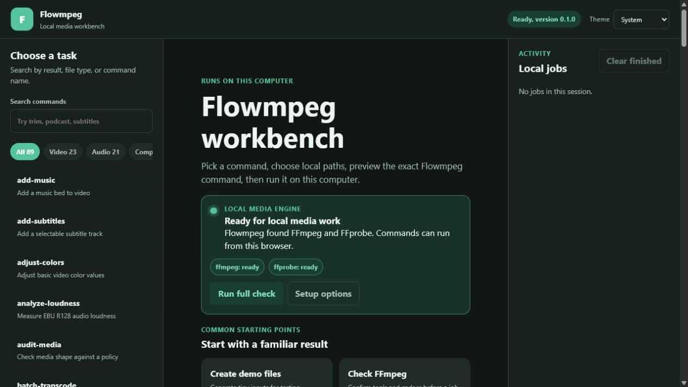
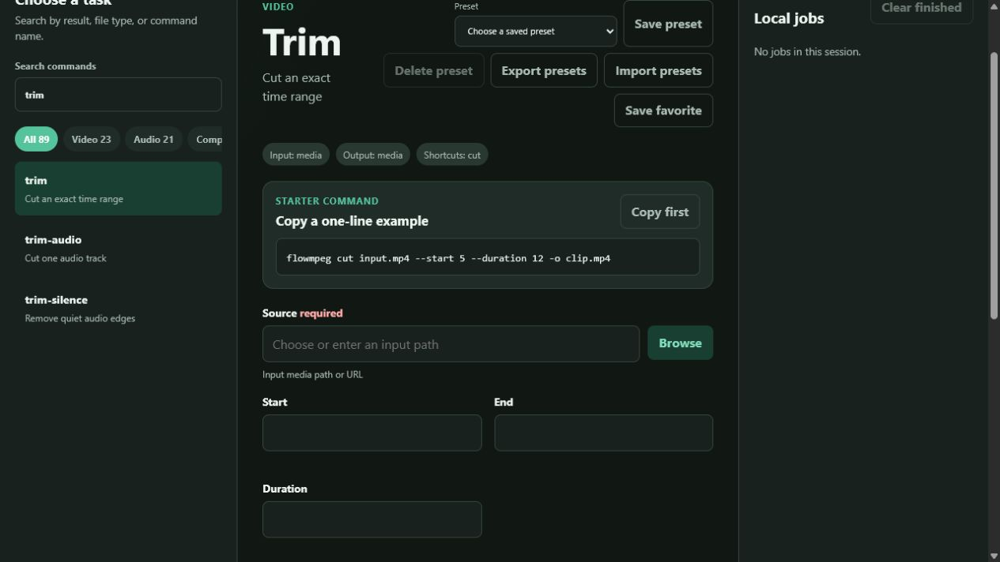
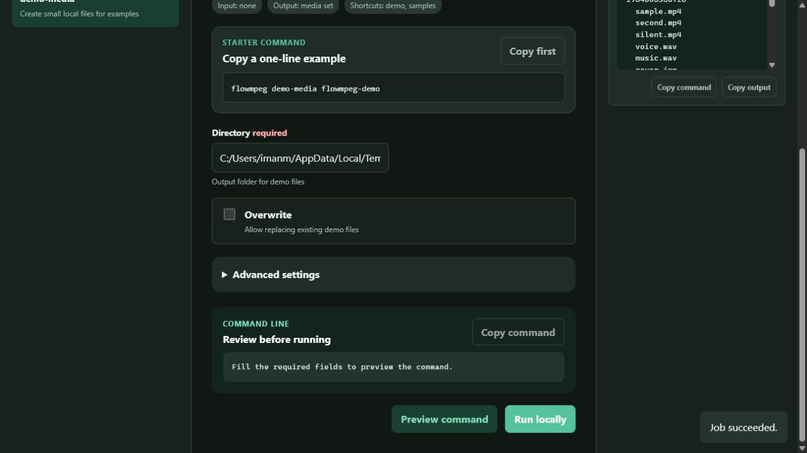

# Local browser interface

The Flowmpeg UI gives every installed command a form in the browser. The work
still runs through the local `flowmpeg` command, so media does not need to be
uploaded to another service.

I use the UI when I want to see the available fields, browse to local files,
and review the final command before starting FFmpeg.

## Start it

Install Flowmpeg, open CMD, PowerShell, or a terminal, then run:

```console
flowmpeg ui
```

Flowmpeg chooses a free local port and opens the default browser. The terminal
prints the exact address, for example:

```text
Flowmpeg UI: http://127.0.0.1:49152/
```

Keep that terminal open while using the page. Press `Ctrl+C` in the terminal
when the work is finished.

The aliases `flowmpeg app` and `flowmpeg gui` open the same interface.

Use a fixed port when a bookmark or local firewall rule needs one:

```console
flowmpeg ui --port 8123
```

Start the server without opening a browser window:

```console
flowmpeg ui --no-browser
```

Then copy the printed local address into a browser on the same computer.

## Screenshots from a local run

Home view with readiness and starter actions:



Command form with built-in one-line examples:



Completed local demo-media job:



## First run

1. Select **Check FFmpeg** in Quick start.
2. Select **Run locally**.
3. Read the job card on the right.

A ready installation reports paths for FFmpeg and FFprobe, followed by the
available command feature groups. If either program is missing, select
**Set up FFmpeg**. The setup form checks the machine without changing it by
default. Enabling its install choice shows a confirmation before a package
manager can run.

## How the page is arranged

```text
+----------------------+----------------------------+----------------------+
| Search and commands  | Selected command form      | Local job activity   |
|                      |                            |                      |
| category filters     | inputs and options         | queued               |
| favorites            | advanced settings          | running              |
| all command cards    | command preview            | result and output    |
+----------------------+----------------------------+----------------------+
```

On a narrow screen the three areas stack vertically. The command form is made
from the same parser and catalog used by the terminal. New terminal commands
therefore have one source of argument names, defaults, choices, and help text.

The category counts show the current command surface. Search matches command
names, aliases, descriptions, categories, and tags. For example, searching
`podcast`, `privacy`, or `subtitle` narrows the list to related work.

For result-based examples, use the [UI recipe book](ui-recipes.md). It pairs
inputs, commands, expected outputs, and the reason each job is useful.

## A normal editing job

To create a 20 second clip:

1. Select **Trim** from Quick start or search for `trim`.
2. Browse to `input.mp4` in **Source**.
3. Enter `10` for **Start** and `20` for **Duration**.
4. Choose `clip.mp4` for **Output**.
5. Select **Preview command**.
6. Review the command, then select **Run locally**.

The preview is equivalent to:

```console
flowmpeg trim input.mp4 --start 10 --duration 20 --output clip.mp4
```

Paths containing spaces or shell characters remain individual arguments. The
UI starts Python with an argument list and does not pass a joined string to a
shell.

## Real jobs by domain

Each row shows what to select, a useful set of form values, and the expected
artifact or report.

| Result | Command | Main values | Expected output |
|---|---|---|---|
| Smaller delivery video | Compress video | source, CRF 24, width 1280, output | MP4 with H.264 video and AAC audio |
| Vertical social clip | Social video | source, target vertical, output | 1080 by 1920 MP4 |
| Exact audio track | Extract audio | source, output `voice.mp3` | Audio-only MP3 |
| Speech cleanup | Podcast voice | recording, output | Filtered WAV or encoded audio file |
| Music under speech | Duck music | video, music, output | MP4 with sidechain ducking |
| Corner logo | Watermark | video, image, position, output | MP4 with the image overlaid |
| Four-camera view | Grid | four source lines, output | Tiled MP4 |
| Open captions | Burn subtitles | video, subtitle file, output | Caption text rendered into frames |
| Review image | Contact sheet | source, rows, columns, output | One JPG contact sheet |
| Animated preview | Make GIF | source, start, duration, output | Palette-generated GIF |
| Streaming folder | HLS | source, segment duration, output folder | Owned playlist and segment set |
| Frame review set | Extract frames | source, interval or FPS, output folder | Owned numbered images |
| Quiet ranges | Find silence | source, threshold, minimum duration | Text or JSON time intervals |
| Delivery policy | Audit media | source and expected limits | Findings with stable codes |
| Codec support | Doctor | optional command name | Local capability report |
| Folder conversion | Batch transcode | input pattern, output folder | Ordered converted files |

## Input and output browsing

Select **Browse** beside a path field to open the local path picker. It lists
names, folder status, size, and modification time. It does not read media file
contents.

- Input fields select an existing file or folder.
- Multi-input fields can collect several selected paths.
- Output file fields let you choose a folder and enter a new filename.
- Output folder fields can create one direct child folder.

Folder creation rejects empty names, parent traversal, path separators, and
an existing destination. This keeps the action inside the folder currently
shown by the picker.

URLs can still be typed into input fields when the selected command accepts a
network source. Flowmpeg passes that URL to FFmpeg only when the job runs.

## Preview before running

**Preview command** validates the form and returns the exact Flowmpeg command.
It does not start a process. Validation messages appear beside the related
field when possible.

The preview has several uses:

- Confirm paths and option values.
- Copy a one-line command for CMD or PowerShell.
- Compare two sets of form choices.
- Learn the terminal form of an operation.

Passwords and token-shaped URL parts use the same diagnostic redaction rules
as terminal dry runs. Do not put private values into output filenames or other
ordinary arguments.

## Jobs and cancellation

**Run locally** queues one process. The default UI runs one media process at a
time so two encoders do not compete for the same machine by accident. Each job
card shows one of these states:

| State | Meaning |
|---|---|
| queued | Waiting for the earlier job |
| running | The local command has started |
| succeeded | The command returned exit code 0 |
| failed | The command returned a nonzero exit code |
| cancelled | Cancellation was requested |

Select **Cancel job** to stop a queued job or the running process tree. The
latest command output is kept in the job card. Output storage is bounded so a
long FFmpeg log cannot grow the browser session without limit.

**Clear finished** removes completed job cards from the current UI session. It
does not delete output files.

Closing the tab does not stop the local server. Stop it with `Ctrl+C` in the
terminal. The server then requests cancellation for active jobs before it
releases the port.

## Existing files and system changes

Flowmpeg protects outputs by default. If **Overwrite** is enabled, the UI asks
for confirmation because the selected destination may be replaced.

The setup command asks for a separate confirmation when package installation
is enabled. The confirmation names the system package manager action.

These prompts are extra checks. Review the preview and output path before
starting a job.

## Favorites and presets

**Save favorite** pins a command near the top of the command list.

**Save preset** stores the current fields under a name for the selected
command. Loading that preset restores the form values. **Delete preset**
removes the selected saved entry.

Favorites, presets, and theme choice are stored in the browser's local
storage. They stay on that browser profile and are not written to project
files. Private browsing or cleared site data removes them.

A preset records values, not media. Moving a file can leave a saved path out
of date, so preview it again before running.

## Keyboard controls

| Key | Action |
|---|---|
| `/` | Focus command search when not editing a field |
| `Escape` | Clear search while search has focus |
| `Up` or `Down` | Move between focused command cards |
| `Ctrl+Enter` | Run the valid form, or request a preview if running is disabled |
| `Command+Enter` | Same action on macOS |

The page follows the browser's system color preference by default. The theme
menu can lock it to light or dark. Motion is reduced when the operating system
asks for reduced motion.

## Local security model

The UI is intended for the computer that started it.

- The server accepts only `127.0.0.1`, `localhost`, or `::1`.
- Port `0`, the default, asks the operating system for a free local port.
- Each launch creates a random request token.
- State-changing API calls require that token.
- Command execution uses `shell=False` and a tuple of arguments.
- Request bodies and retained process output have size limits.
- Browser responses set a content security policy and frame protection.
- The path picker returns metadata, not file contents.

Flowmpeg does not expose an option to bind this UI to a LAN address. For work
on another computer, install and start Flowmpeg on that computer.

## Troubleshooting

### The browser did not open

Copy the `Flowmpeg UI:` address from the terminal. Or start with:

```console
flowmpeg ui --no-browser --port 8123
```

Then open `http://127.0.0.1:8123/` on the same computer.

### The port is already in use

Omit `--port` to choose a free port:

```console
flowmpeg ui
```

Or select another fixed port:

```console
flowmpeg ui --port 8124
```

### FFmpeg is missing

Open **Set up FFmpeg**, run the check, and read the proposed command. The
[installation guide](installation.md) covers platform-specific choices and
custom executable paths.

### A command is disabled

The `ui` command is visible because the form catalog covers every installed
command, but it cannot start another UI from inside the current UI. Run a
second server from a terminal if a separate session is needed.

### A job failed

Read the job card from the bottom upward. The last lines usually contain the
FFmpeg error and Flowmpeg identifier. The [error guide](errors.md) maps stable
identifiers to recovery steps. Run the same operation with **Preview command**
and copy it to a terminal when a larger terminal window is easier to inspect.

### The chosen file no longer exists

Open **Browse** again or edit the path. Saved presets do not move files when a
folder is renamed.

## Terminal equivalents

The UI does not define a second command language. These pairs reach the same
Flowmpeg handlers:

```text
UI Check FFmpeg       -> flowmpeg doctor
UI Trim               -> flowmpeg trim ...
UI Extract audio      -> flowmpeg extract-audio ...
UI Batch transcode    -> flowmpeg batch-transcode ...
UI HLS                -> flowmpeg hls ...
UI Audit media        -> flowmpeg audit-media ...
```

That shared path keeps terminal help, browser forms, previews, doctor checks,
and command metadata tied to the same installed version.
