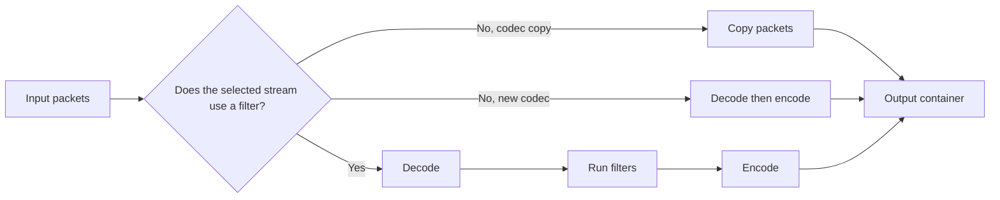
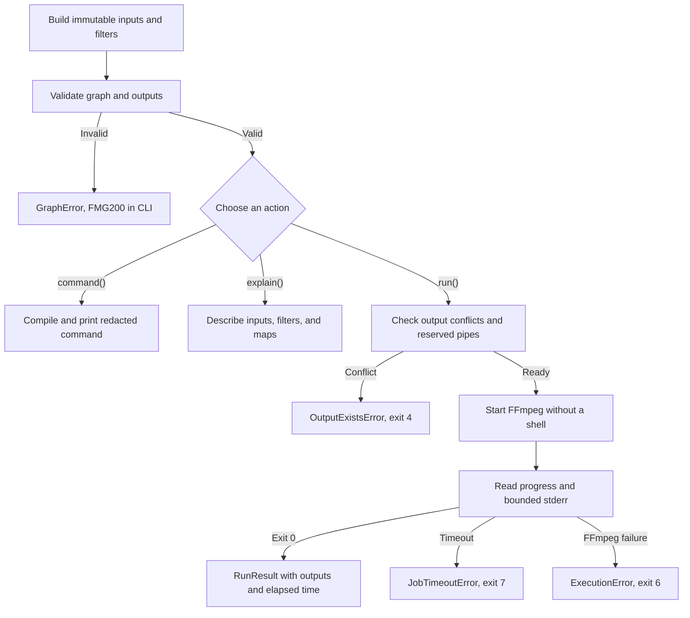
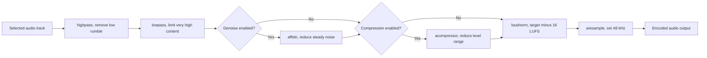

# Visual guide to Flowmpeg behavior

This page turns stream choices and output behavior into small tables and
diagrams. I use it before a job when a short command name does not make the
mapping or encoding choice obvious.

## Before and after media comparison

Use `compare` after any job when the result needs an evidence-based check:

```console
flowmpeg compare original.mp4 delivery.mp4
flowmpeg compare original.mp4 delivery.mp4 --json
```

The terminal table places measured values in the same row:

| Measure | Before | After | Change |
|---|---:|---:|---:|
| Size | 184.20 MiB | 47.80 MiB | -136.40 MiB (-74.0%) |
| Duration | 600 seconds | 600 seconds | +0 seconds |
| Bit rate | 2575 kb/s | 668 kb/s | |
| Video codec | h264 | h264 | |
| Audio codec | pcm_s16le | aac | |
| Dimensions | 1920x1080 | 1280x720 | |
| Frame rate | 30 fps | 30 fps | |
| Streams | 1 video, 1 audio, 1 subtitle | 1 video, 1 audio, 0 subtitle | |

These numbers show the report shape, not a promised compression result. The
command probes both files each time. JSON output includes the original values,
changed values, byte delta, percentage size change, and duration delta. That
makes it suitable for a release check or a batch report.

## Media audit scorecard

`audit` turns probe fields into a pass or fail decision without hiding the
measured shape:

```console
flowmpeg audit delivery.mp4 --expect av --fail-on warning
```

| Area | Example value | Finding rule |
|---|---:|---|
| Required streams | 1 video, 1 audio | Missing expected video is `AUD101`; missing audio is `AUD102` |
| Dimensions | 1920x1080 | Odd width or height is warning `AUD213` |
| Frame rate | 30 fps | Missing or zero frame rate is warning `AUD214` |
| Sample rate | 48000 Hz | Missing or zero sample rate is warning `AUD222` |
| Channels | 2 | Missing or zero channel count is warning `AUD223` |

Use `--fail-on error` when warnings should remain visible but should not stop a
job. Use `--json` when another program needs the summary and finding list.

## Copy, encode, or filter

These are different kinds of work. Copying keeps encoded packet data and is
usually quick. Encoding creates new packet data. A filter first works on
decoded frames or samples, so its stream must be encoded again.

| Command | Video path | Audio path | Filter graph | Main reason to use it |
|---|---|---|---|---|
| `convert` | H.264 encode | AAC encode | No | Make a web MP4 |
| `webm` | VP9 encode | Opus encode | No | Make an open-codec web video |
| `mute` | Packet copy | Dropped | No | Remove audio without changing video packets |
| `audio` | Dropped | Encode or copy by selected codec | No | Save one audio-only track index |
| `join` | Encode | Encode | `concat` | Join matching decoded formats |
| `join-any` | Encode | Encode | Format alignment, then `concat` | Join different decoded formats |
| `clean-metadata` | Packet copy | Packet copy | No | Drop mapped metadata and chapters |
| `captions` | H.264 encode | AAC encode | No | Add an encoded MP4 text track |
| `burn-captions` | H.264 encode | AAC encode | `subtitles` | Render visible caption text |
| `resize` | H.264 encode | AAC encode | `scale` | Change frame dimensions |
| `voice` | Dropped | Encode | Voice filters | Prepare spoken audio |



For example, this command uses `scale`, so video is encoded again:

```console
flowmpeg resize input.mp4 --width 1280 -o smaller.mp4
```

This command maps video directly with `-c:v copy` and drops audio:

```console
flowmpeg mute input.mp4 -o silent.mp4
```

Use `--dry-run` to inspect the actual FFmpeg command when packet preservation
matters.

## Stream retention and track selection

Flowmpeg selectors use an index within one stream kind. `--track 1` on an
audio command means the second audio stream, not the stream whose absolute
FFprobe index is 1.

Imagine this input:

```text
video-only index 0      V0
audio-only index 0      A0
audio-only index 1      A1
subtitle-only index 0   S0
```

| Command | V0 | A0 | A1 | S0 | Notes |
|---|:---:|:---:|:---:|:---:|---|
| `convert input.mkv -o out.mp4` | Keep | Keep | Drop | Drop | First video and first audio |
| `convert input.mkv --no-audio -o out.mp4` | Keep | Drop | Drop | Drop | Silent output |
| `audio input.mkv --track 1 -o out.mp3` | Drop | Drop | Keep | Drop | Second audio-only index |
| `subtitles input.mkv -o out.srt` | Drop | Drop | Drop | Keep | First subtitle-only index |
| `strip-subtitles input.mkv -o out.mp4` | Keep | Keep | Drop | Drop | Re-encodes the first pair |
| `clean-metadata input.mkv -o out.mkv` | Keep | Keep | Drop | Drop | Copies selected packets |
| `clean-metadata input.mkv --subtitles -o out.mkv` | Keep | Keep | Drop | Keep | Copies the first subtitle too |

Probe before selecting a secondary track:

```console
flowmpeg probe input.mkv
flowmpeg audio input.mkv --track 1 -o second-track.mp3
```

The human probe view prints absolute stream numbers for reference. The typed
Python result also separates `video_streams`, `audio_streams`, and
`subtitle_streams`, which makes audio-only indexing explicit.

## Social frame sizes and fill modes

The `social` command names fixed even dimensions. This makes the output size
predictable before FFmpeg reads the input.

| Target | Width | Height | Ratio | Common placement |
|---|---:|---:|---:|---|
| `vertical` | 1080 | 1920 | 9:16 | Full-screen phone video |
| `portrait` | 1080 | 1350 | 4:5 | Tall feed post |
| `square` | 1080 | 1080 | 1:1 | Square feed post |
| `landscape` | 1920 | 1080 | 16:9 | Standard wide video |

```text
vertical      portrait       square        landscape
+-------+     +---------+    +---------+   +---------------+
|       |     |         |    |         |   |               |
|       |     |         |    |         |   |               |
|       |     |         |    |         |   +---------------+
|       |     +---------+    +---------+
+-------+
```

The fill mode decides what happens when the input and output ratios differ.

| Fill | Keeps the full source frame | Adds a generated background | Crops source edges | Main control |
|---|:---:|:---:|:---:|---|
| `fit` | Yes | Solid color | No | `--color` |
| `blur` | Yes | Blurred source copy | Background only | `--blur` |
| `crop` | No | No | Yes | Centered crop |

```console
flowmpeg social wide.mp4 --target vertical --fill fit --color black -o fit.mp4
flowmpeg social wide.mp4 --target vertical --fill blur --blur 24 -o blur.mp4
flowmpeg social wide.mp4 --target vertical --fill crop -o crop.mp4
```

Use `fit` when every source pixel must remain visible. Use `crop` when filling
the frame matters more than its outer edges. `blur` keeps the full foreground
and fills unused space with a scaled, blurred copy.

## Plan lifecycle and failure path

Building a Python plan does not start a process. Validation and command
inspection happen before the runner boundary.



The CLI maps typed failures to stable exit codes. It prints one bounded reason
from FFmpeg and keeps the bounded stderr text on `ExecutionError` for Python
callers. Displayed commands and explanations hide recognized URL credentials,
signed query values, and sensitive header values.

```python
from flowmpeg import shortcuts as ff

plan = ff.resize("input.mp4", "small.mp4", width=1280)
print(plan.command())
print(plan.explain())
result = plan.run(timeout=120)
print(result.elapsed)
```

## Podcast voice chain

`voice` is one FFmpeg job with a fixed chain for spoken audio. Each filter step
has a separate purpose, so the order matters.



| Stage | Default control | What a larger value changes |
|---|---:|---|
| High-pass | 80 Hz | Removes more low-frequency content |
| Low-pass | 12000 Hz | A larger cutoff keeps more high-frequency content |
| Noise reduction | 12 dB | Applies stronger steady-noise reduction |
| Compressor ratio | 3:1 | Pushes loud sections closer to quieter sections |
| Loudness target | -16 LUFS | Default target, set another with `--integrated` |

```console
flowmpeg voice raw.wav -o finished.wav
flowmpeg voice raw.wav --no-denoise --no-compress -o level-only.wav
```

The chain is meant for a useful first pass, not restoration of clipped or
heavily distorted speech. Run `flowmpeg waveform` or inspect the result in an
audio editor when gain changes are important.

## Fixed privacy blur coordinates

`privacy-blur` uses pixels measured from the top-left corner of the video.
The rectangle stays at that position for the whole output.

```text
(0,0) frame origin
  +--------------------------------------------------+
  |                                                  |
  |       x                                          |
  |       <------>                                   |
  |              (x,y) +-------------------+         |
  |                    |                   |         |
  |                  y |    blurred area   | height  |
  |                    |                   |         |
  |                    +-------------------+         |
  |                         width                    |
  |                                                  |
  +--------------------------------------------------+
```

| Value | Unit | Constraint | Meaning |
|---|---|---|---|
| `x` | pixels | 0 or greater | Left edge of the region |
| `y` | pixels | 0 or greater | Top edge of the region |
| `width` | pixels | Positive | Region width |
| `height` | pixels | Positive | Region height |
| `radius` | pixels | 1 through 100, at most half the shorter side | Blur strength and spread |

```console
flowmpeg probe driveway.mp4
flowmpeg privacy-blur driveway.mp4 --x 820 --y 700 --width 260 --height 90 --radius 18 -o private.mp4
```

The rectangle must fit inside the source frame. This shortcut does not track a
moving face, plate, or screen. Split a moving subject into shorter sections
with different coordinates, or use a tracking tool before Flowmpeg. Review the
entire output before treating it as a privacy edit because motion between
coordinate changes can expose the subject.
