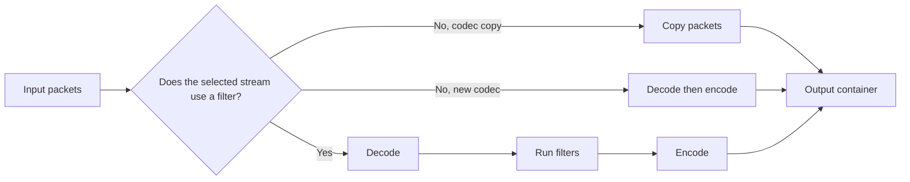

# Visual guide to Flowmpeg behavior

This page turns stream choices and output behavior into small tables and
diagrams. I use it before a job when a short command name does not make the
mapping or encoding choice obvious.

## Copy, encode, or filter

These are different kinds of work. Copying keeps encoded packet data and is
usually quick. Encoding creates new packet data. A filter first works on
decoded frames or samples, so its stream must be encoded again.

| Command | Video path | Audio path | Filter graph | Main reason to use it |
|---|---|---|---|---|
| `convert` | H.264 encode | AAC encode | No | Make a web MP4 |
| `mute` | Packet copy | Dropped | No | Remove audio without changing video packets |
| `audio` | Dropped | Encode or copy by selected codec | No | Save one audio-only track index |
| `join` | Encode | Encode | `concat` | Join matching decoded formats |
| `clean-metadata` | Packet copy | Packet copy | No | Drop mapped metadata and chapters |
| `captions` | Packet copy | Packet copy | No | Add a selectable MP4 text track |
| `resize` | H.264 encode | AAC encode | `scale` | Change frame dimensions |
| `voice` | Dropped | Encode | Voice filters | Prepare spoken audio |



For example, this command uses `scale`, so video is encoded again:

```console
flowmpeg resize input.mp4 --width 1280 -o smaller.mp4
```

This command maps video directly with `-c:v copy` and drops audio:

```console
flowmpeg mute input.mp4 -o silent.mp4
```

Use `--dry-run` to inspect the actual FFmpeg command when packet preservation
matters.

## Stream retention and track selection

Flowmpeg selectors use an index within one stream kind. `--track 1` on an
audio command means the second audio stream, not the stream whose absolute
FFprobe index is 1.

Imagine this input:

```text
video-only index 0      V0
audio-only index 0      A0
audio-only index 1      A1
subtitle-only index 0   S0
```

| Command | V0 | A0 | A1 | S0 | Notes |
|---|:---:|:---:|:---:|:---:|---|
| `convert input.mkv -o out.mp4` | Keep | Keep | Drop | Drop | First video and first audio |
| `convert input.mkv --no-audio -o out.mp4` | Keep | Drop | Drop | Drop | Silent output |
| `audio input.mkv --track 1 -o out.mp3` | Drop | Drop | Keep | Drop | Second audio-only index |
| `subtitles input.mkv -o out.srt` | Drop | Drop | Drop | Keep | First subtitle-only index |
| `strip-subtitles input.mkv -o out.mp4` | Keep | Keep | Drop | Drop | Re-encodes the first pair |
| `clean-metadata input.mkv -o out.mkv` | Keep | Keep | Drop | Drop | Copies selected packets |
| `clean-metadata input.mkv --subtitles -o out.mkv` | Keep | Keep | Drop | Keep | Copies the first subtitle too |

Probe before selecting a secondary track:

```console
flowmpeg probe input.mkv
flowmpeg audio input.mkv --track 1 -o second-track.mp3
```

The human probe view prints absolute stream numbers for reference. The typed
Python result also separates `video_streams`, `audio_streams`, and
`subtitle_streams`, which makes audio-only indexing explicit.
